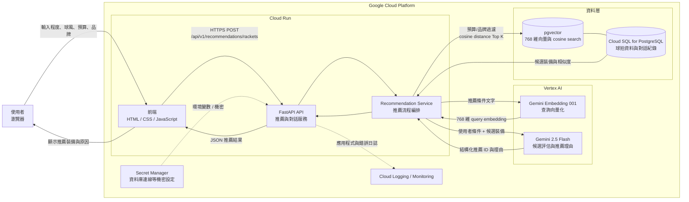
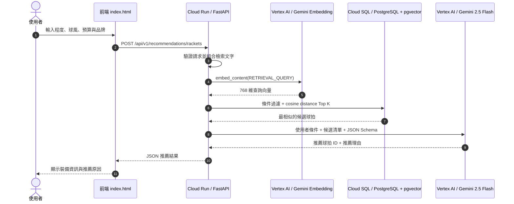
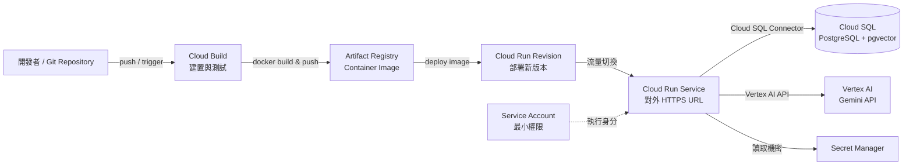

# 羽球裝備 AI 推薦系統架構

本文件描述使用者從前端提出羽球裝備推薦需求，後端透過 Gemini Embedding、
PostgreSQL/pgvector 向量搜尋與 Gemini 模型產生最終推薦，並部署至 Google Cloud
Run 的目標架構。

## 系統架構圖

## 推薦請求時序

## GCP 部署流程

部署步驟如下：

1. 將 FastAPI 應用與前端靜態檔案封裝為容器映像。
2. Cloud Build 執行測試並建置映像，再推送至 Artifact Registry。
3. 將映像部署為 Cloud Run revision，並設定服務帳戶與必要環境變數。
4. Cloud Run 透過 Cloud SQL Connector 連線至啟用 `pgvector` 的 PostgreSQL。
5. Cloud Run 服務帳戶取得 Vertex AI User、Cloud SQL Client，以及 Secret
   Manager Secret Accessor 等最小必要權限。
6. 驗證 `/health` 後，將流量切換到新 revision；失敗時保留前一 revision
   以便回復。

## 元件與現有程式對照

| 架構元件 | 專案實作 |
| --- | --- |
| 前端推薦表單 | `index.html` |
| FastAPI 入口 | `app/main.py` |
| 推薦 API | `app/api/v1/recommendations.py` |
| 推薦流程編排 | `app/services/recommendation_service.py` |
| Gemini Embedding | `app/services/embedding_service.py` |
| Gemini 結構化推薦 | `app/services/gemini_service.py` |
| pgvector 相似度搜尋 | `app/repositories/racket_repository.py` |
| PostgreSQL 連線 | `app/core/database.py` |
| 資料表 Migration | `alembic/versions/` |

## 主要設定

| 設定 | 建議來源 | 說明 |
| --- | --- | --- |
| `GOOGLE_CLOUD_PROJECT` | Cloud Run 環境變數 | GCP Project ID |
| `GOOGLE_CLOUD_LOCATION` | Cloud Run 環境變數 | Vertex AI 區域，目前預設為 `global` |
| `GEMINI_MODEL` | Cloud Run 環境變數 | 預設 `gemini-2.5-flash` |
| `DATABASE_URL` | Secret Manager | Cloud SQL PostgreSQL 連線資訊 |

正式環境不應將服務帳戶金鑰放入容器。Cloud Run 應直接使用綁定的服務帳戶
取得 Vertex AI、Cloud SQL 與 Secret Manager 的存取權限。
